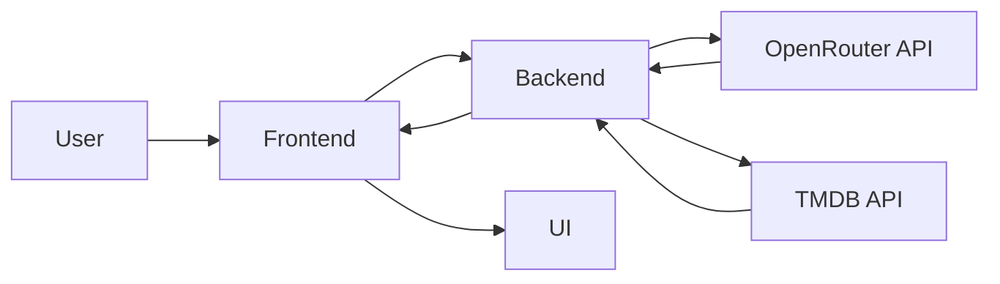

<div align="center">

# CineMind AI

### AI-powered movie & web series recommendation platform

*Discover what to watch next with mood-aware AI, real TMDB metadata, and a cinematic browsing experience.*

[](https://cinemind-ai-kk34.onrender.com/)

[](https://openrouter.ai/)
[](https://developer.themoviedb.org/reference/getting-started)
[](https://nodejs.org/en/download)
[](https://tailwindcss.com/docs/installation/using-vite)

<br />


</div>

---

## ✨ Features

### 🎯 AI Features
- 🤖 Generates personalized recommendations from moods, intent, and conversational cues
- 🧠 Supports both movie and web series discovery in a single flow
- 💬 Includes an AI chat assistant for natural-language entertainment search
- 🔁 Retries and validates AI responses for stable structured output
- 🎯 Uses favorites and recent searches to personalize recommendations
- Powered by OpenRouter with the `google/gemini-3-flash-preview` model
- Uses structured prompting and normalized JSON parsing for reliable downstream rendering

### 🎬 Movies & 📺 Web Series
- 🎞️ Lets users switch seamlessly between **Movies** and **Web Series**
- 🧾 Returns multiple recommendations in a rich, card-based layout
- 🧠 Supports “More Like This” discovery for similar titles
- 🎥 Provides one-click trailer search via YouTube
- 🖼️ Displays poster-rich result cards with cinematic **View Details** modal previews

### 🌐 Real Data Integration
- 🍿 Integrates **TMDB API** for posters, backdrops, ratings, and metadata
- ⭐ Enriches AI-generated recommendations with real title information
- 🔗 Links directly to TMDB for deeper exploration
- 🖼️ Uses TMDB image assets to elevate visual presentation

### ❤️ User Features
- 💾 Saves favorites in local storage for persistent access
- 📂 Maintains separate saved lists for **Movies** and **Series**
- 🧹 Prevents duplicate favorites automatically
- 📤 Exports favorites as JSON
- 🏷️ Includes counters, quick remove actions, and toggleable list panels

### 🔍 Discovery
- 🔥 Highlights Trending Movies
- 📺 Highlights Trending Series
- 🌟 Surfaces a Movie of the Day
- 🌟 Surfaces a Series of the Day
- 🕘 Stores recent searches for one-click reuse

### 💬 AI Chat Mode
- 🗨️ Supports conversational recommendation discovery
- 🎯 Understands prompts like: *“Suggest something like Interstellar but happier”*
- 🧠 Maintains short-term context across the conversation
- 🎬 Returns suggested titles as interactive recommendation cards

### ⚡ Power Features
- 🎲 Includes a Surprise Me mood randomizer
- ⌨️ Supports keyboard shortcuts for faster interaction
- 🔄 Uses retry logic for resilient API communication
- 🛡️ Handles failures gracefully with fallback UI states
- 🚀 Runs on a lightweight Node.js + Express full-stack architecture

### 🎨 UI/UX
- ✨ Uses a glassmorphism-inspired visual system
- 📱 Stays responsive across desktop and mobile layouts
- 🧊 Includes skeleton loading states for better perceived performance
- 🔔 Provides toast notifications for key user actions
- 🎯 Delivers smooth hover states, card motion, and premium modal interactions

---

## 🚀 Why This Project

CineMind AI solves a common discovery problem: most movie apps are great at listing content, but weak at understanding *intent*. Users usually know the vibe they want, not the exact title.

This project stands out by combining mood-based AI recommendations, conversational discovery, and real TMDB enrichment in one polished product experience. Instead of browsing static catalogs, users can describe how they feel and get context-aware, visually rich recommendations instantly.

---

## 🧠 How It Works



---

## 💬 Try These Prompts

- "A mind-bending sci-fi like Interstellar but happier"
- "Dark thriller with plot twist"
- "Feel good movie for a rainy evening"
- "Weekend binge-worthy mystery series"
- "Romantic movie with cozy late-night vibes"
- "Action movie that feels intense but not too dark"

---

## 🚀 Installation

### 1. Clone the repository
```bash
git clone https://github.com/Sayan-das-001/Cinemind-AI.git
cd Cinemind-AI
```

### 2. Install dependencies
```bash
npm install
```

### 3. Create your environment file
Create a `.env` file in the project root and add:

```env
OPENROUTER_API_KEY=your_openrouter_api_key
TMDB_API_KEY=your_tmdb_api_key
```

### 4. Start the server
```bash
npm start
```

### 5. Open locally
Visit:

```bash
http://localhost:3000
```

---

## 💻 Run Locally

Anyone can download and run CineMind AI locally by following these steps:

1. Download or clone the repository.
2. Install Node.js if it is not already installed.
3. Run `npm install` in the project folder.
4. Create a `.env` file with valid OpenRouter and TMDB API keys.
5. Start the app using `npm start`.
6. Open `http://localhost:3000` in the browser.

---

## ⌨️ Keyboard Shortcuts

| Shortcut | Action |
|---|---|
| `/` | Focus search input |
| `R` | Pick a random mood and fetch recommendations |
| `Esc` | Reset current view |
| `F` | Toggle favorite for the current primary suggestion |

---

## 🛠️ Tech Stack

### Frontend
- HTML5
- Tailwind CSS
- Vanilla JavaScript

### Backend
- Node.js
- Express.js

### AI
- OpenRouter API (Gemini 3 Flash Preview)
- Unified LLM access via OpenRouter

### APIs
- TMDB API
- YouTube Search (via trailer search links)

---

---

## 🏗️ Architecture Decisions

- **Why OpenRouter:** It provides flexible access to powerful LLMs behind a single integration layer, making the app easier to maintain and upgrade.
- **Why structured JSON prompting:** Recommendation cards, chat suggestions, and discovery sections all depend on predictable object shapes, so structured output reduces parsing issues and UI breakage.
- **Why TMDB integration:** AI is strong at taste and intent, while TMDB provides trusted metadata, posters, ratings, and backdrops that make the product feel real and complete.

---

## 💼 Project Highlights

- Built a full-stack AI recommendation platform that translates user mood and intent into actionable movie and web series suggestions.
- Engineered an OpenRouter-powered recommendation pipeline with structured JSON normalization for dependable UI rendering.
- Integrated TMDB enrichment to combine generative recommendations with real posters, backdrops, ratings, and title metadata.
- Designed and shipped a responsive glassmorphism interface with cinematic detail modals, discovery modules, and polished motion states.
- Implemented persistent favorites, recent-search memory, export support, and conversational recommendation flows to strengthen user retention and usability.

---

## ⚠️ Limitations

- AI recommendations can vary between requests because generative outputs are probabilistic.
- The app depends on valid OpenRouter and TMDB API keys to function fully.
- Free-tier or rate-limited API usage may affect response speed, reliability, or availability.

---

## 🌟 Future Scope

- 🔐 User authentication and cloud-synced watchlists
- 🧾 Review and rating system for saved titles
- 🎙️ Voice-based recommendation search
- 📈 Analytics dashboard for user preferences
- 🌍 Multi-language recommendation support
- 🎥 Embedded trailer playback inside the app
- 🧠 Deeper personalization using recommendation history
- 📱 PWA support for installable mobile experience

---

## 🚀 Deployment

CineMind AI is hosted on **Render** for simple full-stack deployment and live sharing.

Live app: [https://cinemind-ai-kk34.onrender.com/](https://cinemind-ai-kk34.onrender.com/)

---

## 🤝 Contributing

Contributions are welcome.

1. Fork the repository
2. Create a feature branch
3. Commit your changes
4. Push your branch
5. Open a pull request

---

## 👨‍💻 Author

**Sayan Das**

- GitHub: [Sayan-das-001](https://github.com/Sayan-das-001)
- LinkedIn: [sayan-das-05a255316](https://www.linkedin.com/in/sayan-das-05a255316/)

---

## ⭐ Support

If you like this project, consider giving it a **star** on GitHub. It helps the project grow and makes it easier for others to discover.

---

## 📜 License

This project is licensed under the [](https://github.com/Sayan-das-001/Cinemind-AI/blob/main/LICENSE.md).
