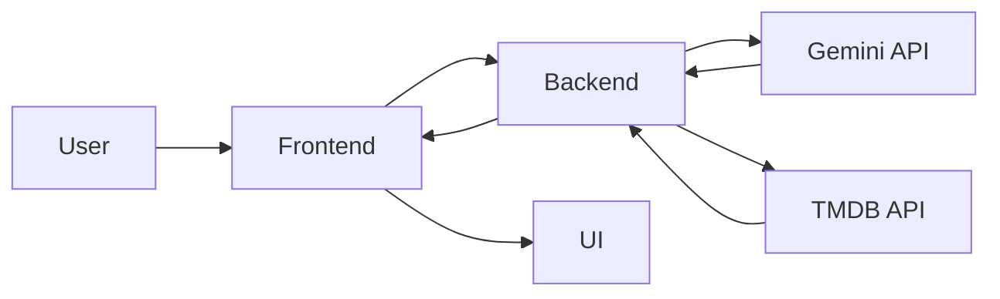

<div align="center">

# CineMind AI

### AI-powered movie & web series recommendation platform

[](https://cinemind-ai-kk34.onrender.com/)


</div>

---

## 🎥 Demo Preview

A demo GIF or short walkthrough video can be added here later to showcase the app experience.

---

## ✨ Features

### 🎯 AI Features
- 🤖 Generates personalized movie recommendations based on mood and intent
- 🧠 Supports web series recommendations alongside movies
- 💬 Includes an AI chat assistant for natural-language entertainment discovery
- 🔁 Retries and validates AI JSON responses for stable structured output
- 🎯 Uses personalization context from favorites and recent searches

### 🎬 Movies & 📺 Web Series
- 🎞️ Toggle between **Movies** and **Web Series** modes
- 🧾 Returns multiple recommendations in a rich card layout
- 🧠 “More Like This” suggestions for similar content
- 🎥 Trailer quick-access via YouTube search
- 🖼️ Poster-rich result cards with visual detail panels

### 🌐 Real Data Integration
- 🍿 Integrates **TMDB API** for posters, backdrops, ratings, and metadata
- ⭐ Enriches AI recommendations with real-world title details
- 🔗 Links directly to TMDB pages for deeper exploration
- 🖼️ Uses TMDB image assets for premium visual presentation

### ❤️ User Features
- 💾 Save favorites in local storage
- 📂 Separate favorite lists for **Movies** and **Series**
- 🧹 Prevents duplicate saved items
- 📤 Export favorites as JSON
- 🏷️ Includes favorites counter badges and quick remove actions

### 🔍 Discovery
- 🔥 Trending Movies section
- 📺 Trending Series section
- 🌟 Movie of the Day
- 🌟 Series of the Day
- 🕘 Recent search history with one-click reuse

### 💬 AI Chat Mode
- 🗨️ Conversational recommendation assistant
- 🎯 Understands prompts like: *“Suggest something like Interstellar but happier”*
- 🧠 Maintains short conversation context
- 🎬 Returns suggested titles directly inside the chat experience

### ⚡ Power Features
- 🎲 Surprise Me mood randomizer
- ⌨️ Keyboard shortcuts for fast interaction
- 🔄 Retry logic for failed API calls
- 🛡️ Graceful error handling with fallback UI
- 🚀 Fast full-stack flow powered by Node.js + Express

### 🎨 UI/UX
- ✨ Glassmorphism-inspired interface
- 📱 Responsive layout for desktop and mobile
- 🧊 Skeleton loading states
- 🔔 Toast notifications
- 🎯 Smooth hover transitions and polished card animations

---

## 🧠 How It Works



---

## 🚀 Installation

### 1. Clone the repository
```bash
git clone https://github.com/Sayan-das-001/Cinemind-AI.git
cd Cinemind-AI
```

### 2. Install dependencies
```bash
npm install
```

### 3. Create your environment file
Create a `.env` file in the project root and add:

```env
GEMINI_API_KEY=your_gemini_api_key
TMDB_API_KEY=your_tmdb_api_key
GEMINI_MODEL=gemini-3-flash-preview
```

### 4. Start the server
```bash
npm start
```

### 5. Open locally
Visit:

```bash
http://localhost:3000
```

---

## 💻 Run Locally

Anyone can download and run CineMind AI locally by following these steps:

1. Download or clone the repository.
2. Install Node.js if it is not already installed.
3. Run `npm install` in the project folder.
4. Create a `.env` file with valid Gemini and TMDB API keys.
5. Start the app using `npm start`.
6. Open `http://localhost:3000` in the browser.

---

## ⌨️ Keyboard Shortcuts

| Shortcut | Action |
|---|---|
| `/` | Focus search input |
| `R` | Pick a random mood and fetch recommendations |
| `Esc` | Reset current view |
| `F` | Toggle favorite for the active item |

---

## 🛠️ Tech Stack

### Frontend
- HTML5
- Tailwind CSS
- Vanilla JavaScript

### Backend
- Node.js
- Express.js

### AI
- Google Gemini API
- `@google/generative-ai`

### APIs
- TMDB API
- YouTube Search (via trailer search links)

---

## 📸 Screenshots

Screenshots can be added here later to showcase:
- Home page
- Recommendation results
- AI chat interface
- Favorites and discovery sections

---

## 💼 Project Highlights

- Built a full-stack AI recommendation platform using the Gemini API for mood-based and conversational entertainment discovery.
- Integrated TMDB API for real-time posters, ratings, metadata, and visual enrichment of recommendations.
- Designed a responsive, premium UI with Tailwind CSS, glassmorphism styling, animations, and skeleton loaders.
- Implemented a favorites system with separate movie and series lists, export support, and persistent local storage.
- Developed a scalable Node.js + Express backend with structured JSON prompting, error handling, retry logic, and multi-source API orchestration.

---

## 🌟 Future Scope

- 🔐 User authentication and cloud-synced watchlists
- 🧾 Review and rating system for saved titles
- 🎙️ Voice-based recommendation search
- 📈 Analytics dashboard for user preferences
- 🌍 Multi-language recommendation support
- 🎥 Embedded trailer playback inside the app
- 🧠 Deeper personalization using recommendation history
- 📱 PWA support for installable mobile experience

---

## 🤝 Contributing

Contributions are welcome.

1. Fork the repository
2. Create a feature branch
3. Commit your changes
4. Push your branch
5. Open a pull request

---

## ⭐ Support

If you like this project, consider giving it a **star** on GitHub. It helps the project grow and makes it easier for others to discover.

---

## 📜 License

This project is licensed under the [](https://github.com/Sayan-das-001/Cinemind-AI/blob/main/LICENSE.md).
